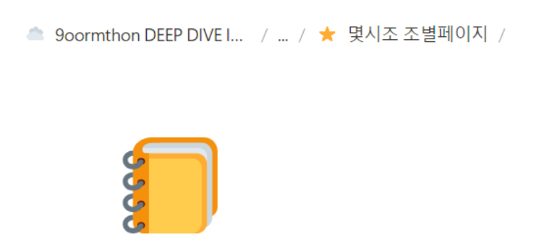

## 구름톤 딥다이브 풀스택 11회차 1차 스터디 1회 정기모임

팀원 팀빌딩 후, 각자 1주일동안 공부후 나누는 시간을 가졌다.

> 알고리즘 풀이

자바 (스프링 입문) 관련 cs 면접 
알고리즘 풀이
나는 알고리즘을 1182 백준을 풀었다. 그후, 이에 대해서 설명을 했는데 확실히 아직 백트래킹을 구현하는 데 있어서 능숙하지 않은 것 같다..

다른 분 알고리즘 풀이
한 분은 13023 ABCDE 문제를 푸셨고, 한 분은 프로그래머스 짝수합 문제를 푸셨다.

두 문제 다 풀어봐야겠다.

> CS- 스프링 강의 이론 내용 면접

1. 원시 자료형 종류 및 이에 대해 설명해 주세요
byte : 나이
short : 온도
int : 인구수
2. 원시 자료형 vs 참조 자료형
원시 자료형은 값 자체를 변수로, 참조 자료형은 주소값
3. 빈<> 다이아몬드 연산자의 역할
컴파일 오류를 발생시켜 타입추론 가능하게함
4. 접근제어자 
default : 동일 패키지 내에서만 , protected : 동일패키지, 상속 받은 클래스만
5. 다형성이 어떻게 객체지향 프로그래밍을 할 수 있나
오버라이딩(interface) vs 오버로딩(인자가 다른, 이름은 같은 메소드)
결합도를 낮추고, 유연하게 설계할 수 있다

자바에 대한 기초적인 문제로 서로 한 문제씩 뽑아 대답하는 시간을 가졌는데

확실히 이렇게 하니까 재미있고 더 찾아보게 되는 것 같다.

---

전체적으로 좋은 시작인 1차 스터디 정기 모임이다 :) 